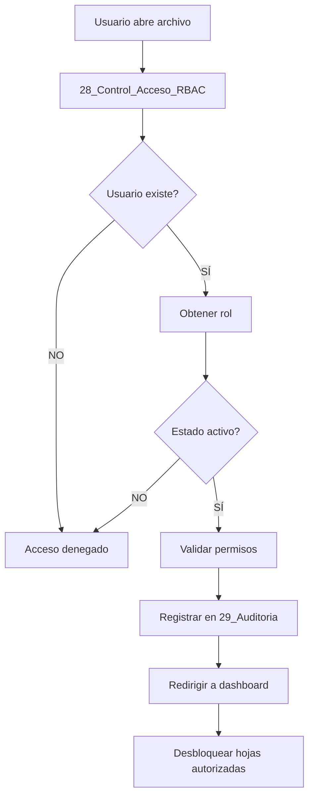

# Pipeline completo v3.3 RBAC - Modelo Financiero Ventreo

Este documento describe el flujo de datos, las fases del pipeline financiero y la matriz RBAC que orquesta cada caso de uso. Recopila la información operativa recibida en la versión 3.3 y la adapta al contexto del monolito modular Django.

## 📚 Índice

1. [Introducción y cambios v3.3](#introducción-y-cambios-v33)
2. [Configuración flexible por tamaño](#configuración-flexible-por-tamaño)
3. [Pipeline de datos completo](#pipeline-de-datos-completo)
4. [Casos de uso detallados](#casos-de-uso-detallados)
5. [Guía de implementación](#guía-de-implementación)
6. [Referencia rápida](#referencia-rápida)

---

## Introducción y cambios v3.3

### Novedades clave

**Sistema RBAC (Role-Based Access Control) completo:**

```
✓ 9 roles jerárquicos disponibles
✓ Permisos granulares por hoja y función
✓ Protección con contraseñas por rol
✓ Auditoría de todas las acciones
✓ Dashboards personalizados por rol
✓ Validación automática de acceso
✓ Log de trazabilidad detallado
✓ Configuración flexible según tamaño empresa
✓ Roles acumulables (una persona puede tener varios)
✓ Workflow de aprobaciones automático
```

### Estructura del modelo (30+ hojas)

- **Hojas core (26 originales):** 00-27 del modelo base v3.2.1.
- **Hojas RBAC adicionales:**
  - `28_Control_Acceso_RBAC`: Usuarios, roles y permisos.
  - `29_Auditoria_Cambios`: Log completo de modificaciones.
  - `30_Dashboard_CEO`: Vista ejecutiva.
  - `31_Dashboard_CFO`: Panel financiero detallado.
  - `32_Dashboard_Contador`: Vista fiscal especializada.
  - `33_Dashboard_Operaciones`: Control operativo por área.

Estas hojas se representan en el código mediante catálogos y contratos declarados en `finance.domain`, `dashboards.configs` y `access_control`.

---

## Configuración flexible por tamaño

Para adaptar el pipeline responde estas preguntas:

1. **¿Cuántas personas hay en la empresa?**
   - 1-3 → Micro
   - 4-10 → Pequeña
   - 11-50 → Mediana
   - 50+ → Grande
2. **¿CEO y CFO son personas diferentes?**
   - No → Micro (CEO acumula roles)
   - Sí → continuar
3. **¿Existe Controller independiente del CFO?**
   - No → Pequeña (CFO acumula)
   - Sí → continuar
4. **¿Hay auditorías formales?**
   - No → Mediana
   - Sí → Grande

### Configuración 1: Micro empresa (1-3 personas)

**Perfil:** Startups en fase inicial, freelancers con contador externo, ingresos < $500k.

**Roles activos (2-3):**
```
├─ Fundador/CEO (acumula CEO + CFO + Controller + Analista)
├─ Contador externo (solo área fiscal)
└─ Viewer opcional (inversionistas)
```

**Características:** mínima burocracia, fundador sin trabas, contador con acceso limitado, auditoría básica, sin aprobaciones múltiples, setup en 30 minutos.

**Matriz de permisos (extracto):**
```
Hoja                      | Fundador | Contador | Viewer
--------------------------|----------|----------|-------
01_Parametros             | RW       | R        | -
02_Inversion              | RW       | R        | -
05_Costos_Fijos           | RW       | R        | -
26_Calc_Impuestos         | RW       | RWA      | -
24_Dashboard              | R        | R        | R
19_Escenarios             | RW       | -        | -
29_Auditoria              | R        | R        | -
```

**Ejemplo real:**
```
Empresa: Ventreo (2 personas)
├─ Juan (Fundador) – Roles: CEO+CFO+Controller+Analista
└─ Pedro (Contador externo) – Rol: Contador
```

### Configuración 2: Pequeña empresa (4-10 personas)

**Perfil:** Startups en crecimiento, PyMEs establecidas, ingresos $500k-$5M.

**Roles activos (3-5):**
```
├─ CEO (estrategia/aprobaciones)
├─ CFO (acumula CFO + Controller)
├─ Contador
├─ Gerente operativo (1-2 áreas)
└─ Analista/Viewer
```

**Características:** separación CEO/CFO, aprobaciones para cambios >10%, gerentes ven sólo su área, workflow simple, auditoría completa, setup en 2 horas.

**Matriz de permisos (extracto):**
```
Hoja                 | CEO | CFO | Contador | Gerente | Analista
---------------------|-----|-----|----------|---------|---------
Parametros_Globales  | RA  | RW  | R        | R       | R
Inversion_Inicial    | RA  | RW  | R        | R       | R
Costos_Fijos         | R   | RW  | R        | R(área) | R
Modelo_Precios       | A   | RW* | R        | -       | R
Calc_Impuestos       | R   | RW  | RWA      | -       | R
Escenarios           | RA  | RW  | -        | -       | R
Dashboard            | R   | R   | R        | R       | R
```
`*` Cambios >10% requieren aprobación CEO.

**Ejemplo real:**
```
Empresa: Ventreo Crecimiento (6 personas)
├─ Juan (CEO)
├─ María (CFO)
├─ Pedro (Contador)
├─ Ana (Gerente Ventas)
├─ Luis (Gerente Ops)
└─ Sofia (Analista)
```

### Configuración 3: Mediana empresa (11-50 personas)

**Perfil:** Empresas con múltiples departamentos y procesos formalizados, ingresos $5M-$50M.

**Roles activos (5-7):** CEO, CFO, Controller, Contador, Analista financiero, Gerentes operativos, Auditor.

**Características:** roles especializados, segregación de funciones, tres niveles de aprobación, auditoría + reportes compliance, setup en 1 día.

**Matriz de permisos (extracto):**
```
Hoja             | CEO | CFO | Controller | Contador | Analista | Gerente | Auditor
-----------------|-----|-----|------------|----------|----------|---------|-------
Parametros       | RA  | RW  | R          | R        | R        | R       | R
Inversion        | RA  | RA  | RW         | R        | R        | R       | R
Costos_Fijos     | R   | RW  | RW         | R        | R        | R(área) | R
Costos_Variables | R   | RW  | RW         | R        | R        | RW(área)| R
Calc_Impuestos   | R   | RW  | R          | RWA      | R        | -       | R
Escenarios       | RA  | RW  | RW         | -        | RW       | R       | R
Auditoria        | R   | R   | R          | R        | -        | -       | RW
```

### Configuración 4: Grande/Corporativo (50+ personas)

**Perfil:** Corporaciones, empresas públicas, compliance estricto, ingresos >$50M.

**Roles activos (9):** Super Admin, CEO, CFO, Controller, Contador, Analista financiero, Gerentes operativos, Auditor interno, Viewer.

**Características:** jerarquías completas, hasta 5 niveles de aprobación, auditoría + forensics, setup en 3 días + capacitación.

**Matriz de permisos:** Cobertura total 9 roles × 30 hojas (configurable en `SheetPermission`).

**Niveles de aprobación orientativos:**

| Tamaño | Monto mensual | Aprobación |
| --- | --- | --- |
| Micro | Cualquiera | Fundador |
| Pequeña | < $1k CFO, $1k-$5k CFO, > $5k CEO |
| Mediana | < $1k Controller, $1k-$5k CFO, $5k-$25k CFO+CEO, > $25k CEO+Board |
| Grande | < $500 Gerente, $500-$5k Controller, $5k-$25k CFO, $25k-$100k CEO, > $100k Board |

---

## Pipeline de datos completo

### Fase 0: Autenticación y validación



1. Usuario intenta abrir el archivo (celda `Usuario_Actual`).
2. Sistema busca en `tbl_usuarios` (hoja 28) y obtiene roles acumulados.
3. Valida estado y fecha de expiración; si procede, calcula permisos efectivos (`resolve_sheet_permissions`).
4. Registra el login en `29_Auditoria_Cambios` (`audit.models.AuditEvent`).
5. Carga matriz de permisos (`SheetPermission`) y desbloquea hojas según `R/W/A`.
6. Redirige al dashboard según rol (CEO → hoja 30, CFO → 31, Contador → 32, Gerente → 33, otros → 24).

**Matriz jerárquica de roles:** Super_Admin > CEO > CFO > Controller/Contador > Analista/Gerente > Auditor > Viewer.

### Fase 1: Configuración maestra

1. Usuario CFO edita `01_Parametros_Globales` (permisos `RW`).
2. Validaciones de datos aseguran rangos (IVA 0-25%, ISR 0-40%).
3. Cambios críticos generan notificación al CEO si impactan >15% en KPIs.
4. Auditoría registra timestamp, usuario, celda y valores anterior/nuevo.
5. Recalcula automáticamente `26_Calc_Impuestos`, `09_Modelo_Precios`, `13_Flujo_Efectivo` y dashboards.
6. Crea nombres definidos globales (IVA, ISR, ARPU, Churn, EscenarioActivo) disponibles en todo el libro.

### Fase 2: Inversión con workflow de aprobaciones

1. Controller propone inversión (ej. Servidor DevOps $50,000) → estado `PROPUESTO`.
2. Sistema notifica a CFO; auditoría captura la propuesta.
3. CFO revisa, aprueba nivel 1 → estado `APROBADO_CFO`, notifica al CEO.
4. CEO analiza impacto (ROI, flujo de efectivo, depreciación) y aprueba → estado `APROBADO_FINAL`.
5. Cambios aplicados: `02_Inversion_Inicial`, `27_Depreciacion`, `26_Calc_Impuestos`, `13_Flujo_Efectivo`.
6. Notificaciones finales a Controller, CFO y CEO. Registro completo en auditoría:

```
Timestamp            | Usuario | Rol        | Acción           | Detalle
---------------------|---------|------------|------------------|------------------
2025-01-14 09:00:00  | ana     | Controller | PROPOSE          | DevOps $50k
2025-01-14 11:30:00  | maria   | CFO        | APPROVE_LEVEL1   | Aprobación CFO
2025-01-14 15:00:00  | juan    | CEO        | APPROVE_FINAL    | Aprobación CEO
2025-01-14 15:01:00  | Sistema | -          | APPLY_CHANGES    | Cambios aplicados
```

### Fase 3: Costos con control por área

1. Gerente operativo ingresa; filtros automáticos muestran sólo su área (Ventas/Marketing).
2. Columnas sensibles (salarios individuales) permanecen ocultas para roles sin privilegio.
3. Gerente solicita ajuste presupuestal (`Solicitar Ajuste`), generando ticket `BP-XXXX`.
4. Controller aprueba nivel 1, CFO nivel 2; montos altos escalan a CEO/Board según tabla de montos.
5. Presupuesto actualizado automáticamente y notificaciones emitidas.
6. Auditoría registra cada aprobación y justificación adjunta.

### Fases 4-10: ingresos, flujo, compliance, escenarios, dashboards y alertas

- Cada fase utiliza workflows declarados en `finance.domain` y `finance.models.Workflow`.
- Dashboards (`dashboards.models.Dashboard`, `DashboardKPI`) consumen métricas recalculadas.
- Alertas (`notifications.models.AlertRule`) vigilan cashflow, impuestos y deadlines.
- Auditoría (`audit`) documenta interacciones críticas.

---

## Casos de uso detallados

### Caso 1: Startup micro (fundador + contador)

**Contexto:** 2 personas, fundador hace todo salvo declaraciones.

**Flujo diario:**
```
1. Fundador abre archivo → acceso total (excepto celdas fiscales definitivas).
2. Trabaja en parámetros, inversiones y escenarios.
3. Contador ingresa más tarde → permisos RWA sólo en área fiscal.
4. Intentos de acceso no autorizados se registran como WARN.
5. Contador ajusta nómina, declara impuestos y marca como "DECLARADO".
6. Notificación automática al fundador con resumen fiscal.
```

### Caso 2: Empresa pequeña – CEO aprueba cambio de precios

**Escenario:** CFO propone aumento 12% en precios.

**Pasos clave:**
```
1. CFO modifica 09_Modelo_Precios → cambio >10% activa modal.
2. Solicitud #AP-2025-001 se registra con análisis y ROI.
3. CEO revisa en 30_Dashboard_CEO (impacto MRR, margen, churn).
4. CEO escribe "APROBAR" y confirma.
5. Sistema aplica nuevos precios, recalcula ingresos y notifica a todo el equipo.
```

### Caso 3: Declaración fiscal con validación CFO

```
1. Contador actualiza 26_Calc_Impuestos y 27_Depreciacion.
2. Cambios requieren justificación (campo `reason` en auditoría).
3. CFO revisa y aprueba para enviar declaraciones.
4. Auditor tiene lectura total para reportes externos.
```

### Caso 4: Analista crea escenario, CFO valida, CEO aprueba

```
1. Analista genera escenario en finance.domain.SCENARIO_PLANNING.
2. Workflow exige validación CFO antes de publicar.
3. Dashboards muestran impacto y sensibilidad.
4. CEO o Board aprueba el escenario oficial, versiones previas quedan bloqueadas.
```

### Caso 5: Gerente solicita presupuesto

```
1. Gerente ve sólo sus líneas gracias a filtros por rol.
2. Solicita incremento (ej. software PM +$3k/mes).
3. Controller aprueba, CFO valida, CEO informado según monto.
4. Presupuesto actualizado y notificaciones emitidas.
```

### Caso 6: Operación corporativa completa

```
1. Super Admin administra usuarios y ejecuta pruebas.
2. Todos los cambios siguen el pipeline autenticación → permisos → finanzas → dashboards → alertas.
3. Auditoría centraliza trazabilidad (SOX-ready).
4. Stakeholders externos acceden sólo a dashboards públicos.
```

Cada narrativa se amplía con los detalles técnicos en `docs/use_cases.md`.

---

## Guía de implementación

### Paso 1: Configuración inicial

1. Determinar configuración (Micro, Pequeña, Mediana, Grande).
2. Completar usuarios y roles en `28_Control_Acceso_RBAC`.
3. Activar/desactivar roles y definir matriz `SheetPermission`.
4. Configurar áreas por usuario para filtros automáticos.

### Paso 2: Pruebas de acceso

- Cambiar `Usuario_Actual` y verificar dashboard asignado.
- Validar permisos `R/W/A` y bloqueos.
- Documentar incidencias y ajustar configuración.

### Paso 3: Capacitación de usuarios

- Enviar guía personalizada (permisos, restricciones, proceso de solicitudes, contacto de soporte).
- Explicar cómo revisar auditoría y cómo operar workflows.

### Paso 4: Monitoreo inicial (primera semana)

- Revisar `29_Auditoria_Cambios` diariamente.
- Analizar intentos denegados, cambios críticos y actividad fuera de horario.
- Ajustar matriz y capacitaciones según hallazgos.

---

## Referencia rápida

### Matriz de decisión por tamaño

| Criterio | Micro | Pequeña | Mediana | Grande |
| --- | --- | --- | --- | --- |
| Personas | 1-3 | 4-10 | 11-50 | 50+ |
| Ingresos anuales | <$500k | $500k-$5M | $5M-$50M | >$50M |
| Roles activos | 2-3 | 3-5 | 5-7 | 9 |
| Aprobaciones | Ninguna | CEO > $5k | 2-3 niveles | 4-5 niveles |
| Setup | 30 min | 2 horas | 1 día | 3 días |
| Auditoría | Básica | Completa | Compliance + reportes | SOX-ready |

### Permisos por rol (resumen)

| Rol | Nivel | Enfoque | Acceso típico |
| --- | --- | --- | --- |
| Super_Admin | 1 | Sistemas | Acceso total |
| CEO | 2 | Estrategia | Dashboards + aprobaciones |
| CFO | 3 | Finanzas | Gestión completa |
| Contador | 4 | Fiscal | Área impuestos |
| Controller | 4 | Control | Presupuestos |
| Analista | 5 | Análisis | Escenarios |
| Gerente | 5 | Operaciones | Área propia |
| Auditor | 6 | Auditoría | Lectura + export |
| Viewer | 7 | Consulta | Dashboard público |

---

## Conclusión

El pipeline v3.3 RBAC combina contratos declarativos (`finance.domain`), permisos (`access_control`), auditoría (`audit`) y experiencia ejecutiva (`dashboards`, `notifications`). Esta documentación centraliza la visión operativa necesaria para planear infraestructura, capacitación y evolución del monolito modular Ventreo.
